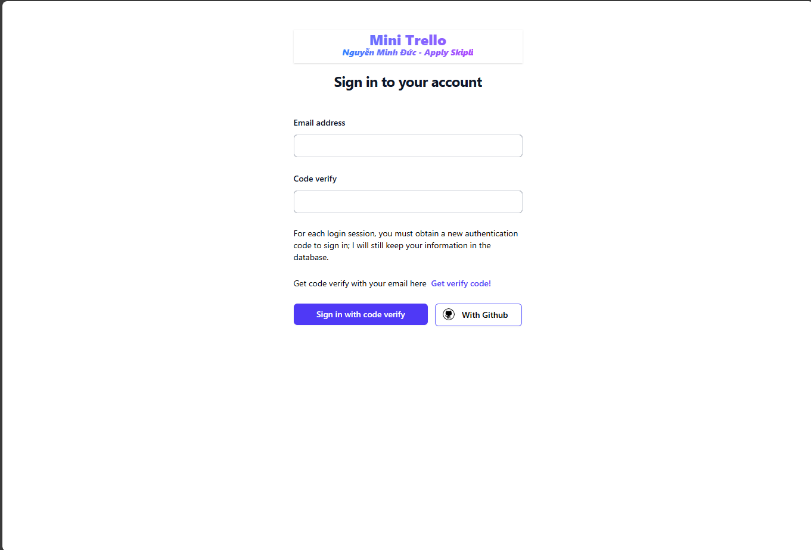
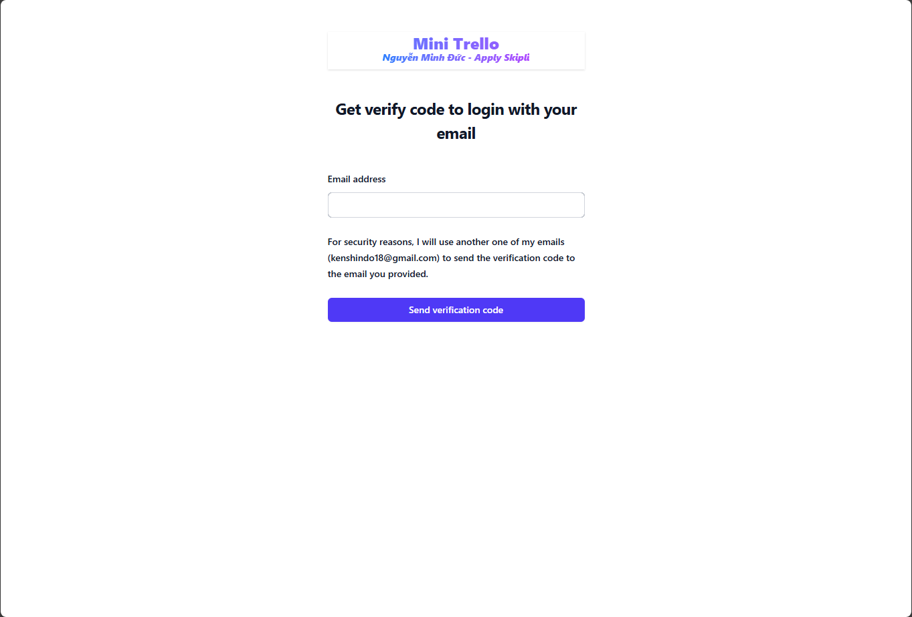
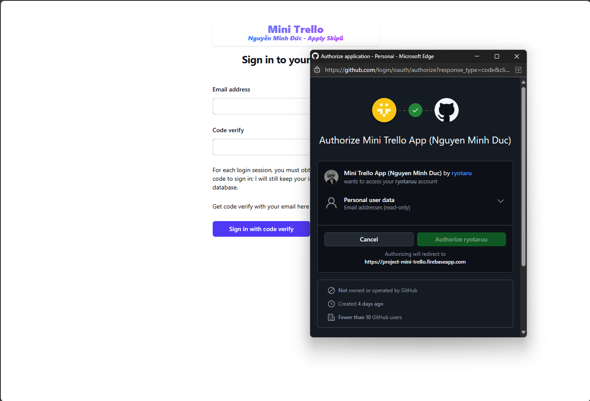
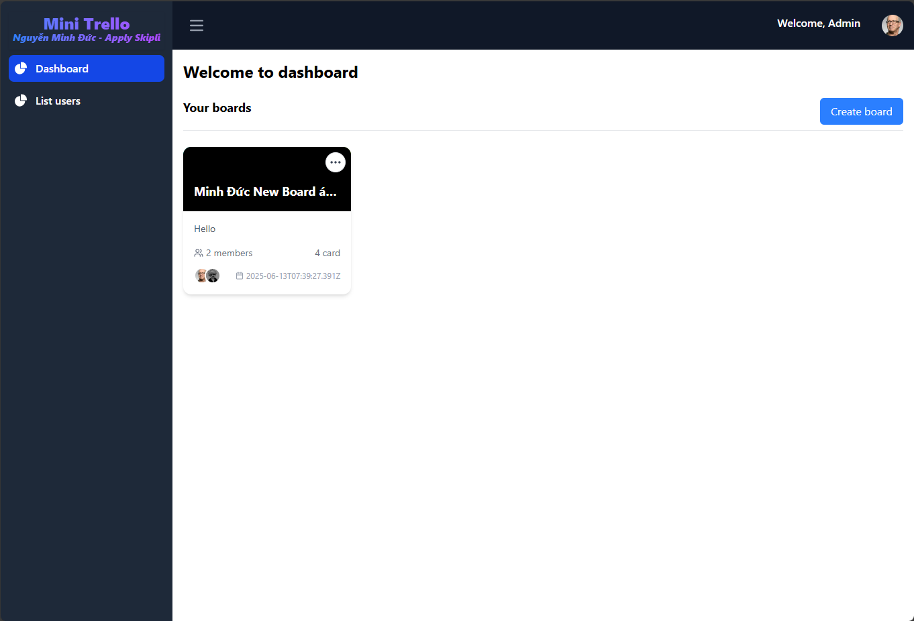
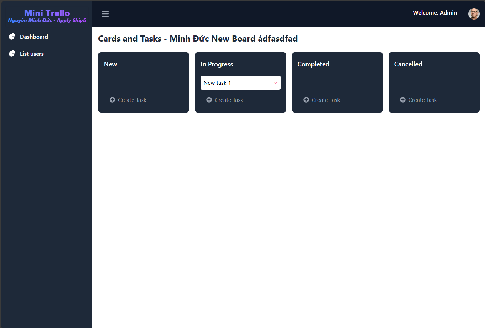
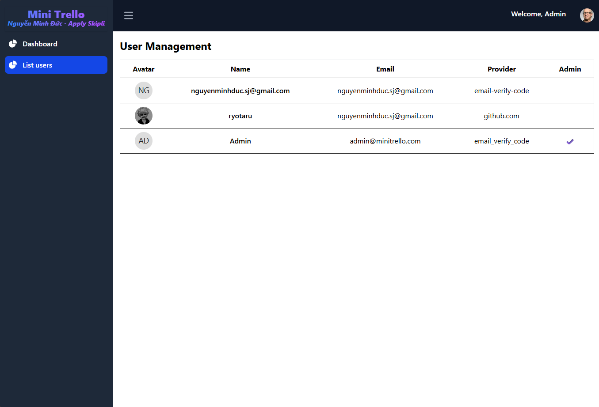
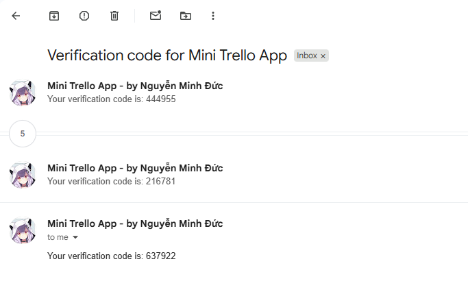

# Mini Trello Project - Nguyễn Minh Đức - Apply Skipli

## Overview
A Mini Trello clone built with React, TypeScript, and Vite, implementing core Trello features with modern authentication methods. This project demonstrates the ability to create a task management system with drag-and-drop functionality, real-time updates, and secure user authentication.

## Key Features

### Board and Card Management
- **Dashboard Board View**: Display all boards in a dashboard layout for easy navigation and management.
- **Add Board**: Create new boards directly from the dashboard. Each board is saved and persisted in Firebase Firestore.
- **Show Board & Card View**: Click on a board to view its details and cards. The board detail page displays all cards (tasks) organized in columns.
- **Card Layout**: The card view features a Kanban-style layout with four columns: New, In Progress, Completed, and Cancelled. Cards can be dragged and dropped between columns for easy workflow management.
- **Modern UI**: The board and card views are styled for clarity, with a horizontal column layout, white text, and a light gray background for improved readability.

### Authentication System
1. **Gmail Authentication**
   - Implemented a secure passwordless login system
   - Developed a custom email verification system using Node.js and Nodemailer
   - Created a backend server to handle email delivery and verification
   - Implemented secure code verification process

2. **GitHub Authentication**
   - Integrated OAuth 2.0 through Firebase Authentication
   - Implemented seamless one-click login with GitHub
   - Set up automatic profile synchronization
   - Configured secure token management

### Technical Implementation
- **Frontend Development**
  - Built with React 18 and TypeScript
  - Implemented using Vite for optimal development experience
  - Responsive design for cross-platform compatibility

- **Backend Services**
  - Firebase Authentication for secure user management
  - Firebase Firestore for real-time database operations
  - Custom Node.js server for email verification
  - Nodemailer integration for reliable email delivery

- **Security Features**
  - Secure token-based authentication
  - Email verification system
  - OAuth 2.0 implementation
  - Protected API endpoints

## Task Management Features

- **Add/Edit/Delete Task**: You can create, update, and remove tasks (cards) within any board. Each task can be edited or deleted directly from the card view.
- **Move Task Between Cards**: Tasks can be easily moved between columns (New, In Progress, Completed, Cancelled) using drag-and-drop, providing a smooth Kanban experience.

## Admin User Management

- **User List Menu (Admin Only)**: An additional menu is available for admin users to view the full list of registered users. This feature is accessible via the sidebar menu "List users" when logged in as an admin.
- **Admin Account**: Admin credentials for testing are provided below (see the end of this README).
- The user management page displays user avatars, names, emails, authentication providers, and admin status in a clear table format.

## Technical Stack
- **Frontend**: React, TypeScript, Vite
- **Authentication**: Firebase Authentication
- **Database**: Firebase Firestore
- **Email Service**: Node.js, Nodemailer
- **OAuth Integration**: GitHub OAuth
- **Development Tools**: ESLint, TypeScript

## Project Setup
1. Clone the repository
2. Frontend Setup:
   - Navigate to the root directory
   - Install dependencies: `npm install`
   - Set up environment variables (create .env file)
   - Run development server: `npm run dev`
   - The server will run on port 5173 by default

3. Backend Setup (Email Verification Server):
   - Navigate to the `backend-send-email` directory
   - Install dependencies: `npm install`
   - Start the server: `npm run dev`
   - The server will run on port 3000 by default

Note: Both frontend and backend servers need to be running simultaneously for the email verification feature to work properly.

## Development Notes
- Currently utilizing Firebase's free tier for development and testing
- Database configured with 30-day data retention
- Cloud Functions implementation available but not deployed due to Firebase's pricing model
- Project is production-ready with proper security measures in place

## Future Improvements
- Implementation of additional authentication providers
- Enhanced email verification system
- Integration of real-time collaboration features
- Performance optimization for large-scale deployment

## Admin Test Account

You can use the following admin account to access admin features:

- **Email:** admin@minitrello.com
- **Password:** admin123

## Screenshots

### Sign In Page

### Sign Up - Get Code Page

### Sign In with GitHub

### Dashboard (with Admin Email)

### Board - Card and Task Management

### User List (Admin View)

### Backend: Send Code Verify Email (Node.js + Nodemailer)

